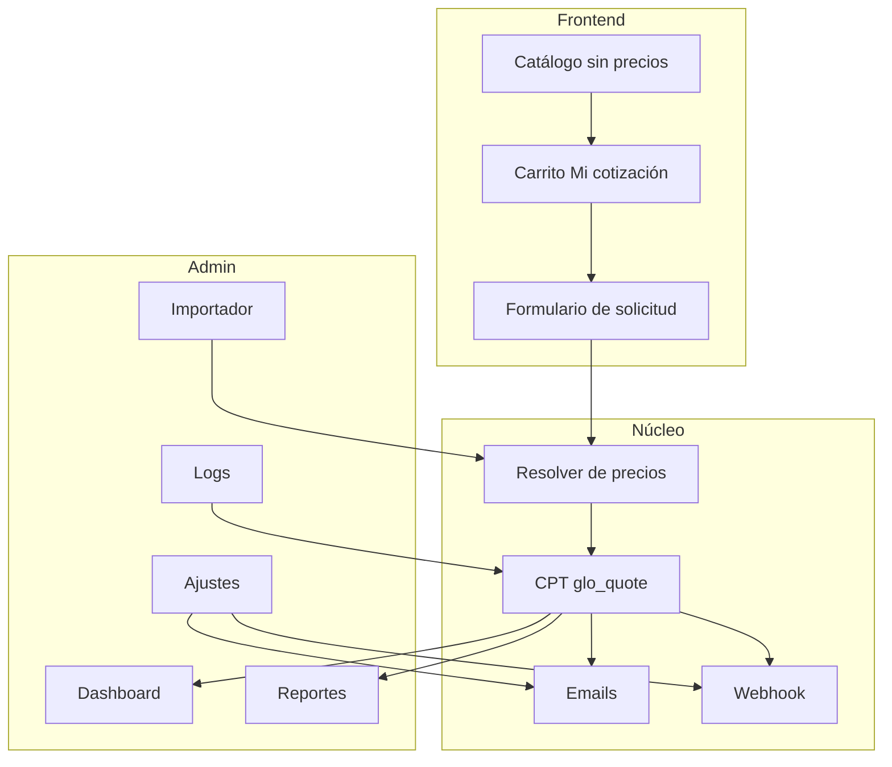
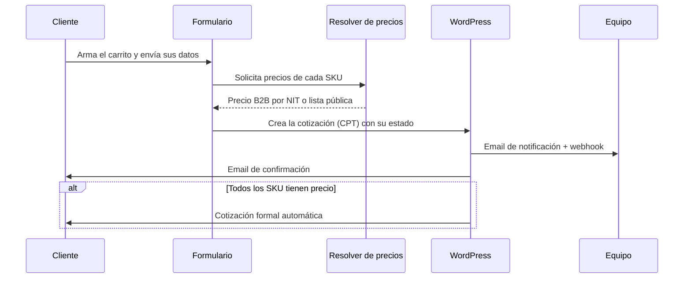

# Glotracol Cotizador

Convierte una tienda WooCommerce en un sistema de solicitud de cotización (RFQ) para B2B: catálogo sin checkout ni pago, donde el cliente arma su lista de productos y pide que le coticen.

    

## Qué resuelve

En muchos negocios mayoristas el precio no es público: depende del cliente, del volumen o de un acuerdo previo. Este plugin retira los precios y el checkout del catálogo de WooCommerce y los reemplaza por un flujo de cotización. El visitante navega el catálogo, agrega productos a "Mi cotización", llena sus datos y envía la solicitud; el equipo comercial responde con los precios, ya sean los de la lista pública o los negociados por NIT para clientes B2B.

Cuando todos los productos de una solicitud ya tienen precio registrado, el plugin puede generar y enviar una cotización formal al cliente de forma automática, sin intervención manual.

## Características

| Área | Qué hace |
|---|---|
| Flujo RFQ | Reemplaza "Añadir al carrito" por "Añadir a mi cotización" y el checkout por un formulario de solicitud. Oculta precios en catálogo, producto, carrito y emails. |
| CRM de clientes B2B | CPT propio de clientes con NIT, razón social, contacto y precios negociados. Índice por NIT para búsqueda directa. |
| Precios en niveles (A/B + B2B) | Precio individual negociado por cliente, **Lista B** (mayoreo) y **Lista A** (pública). Cada cliente puede asignarse a la Lista B; si un producto no tiene precio B, ese cliente cae automáticamente a la Lista A. Cascada del resolver: individual → Lista B → Lista A → pendiente. |
| Auto-cotización | Distingue entre cotización y pedido. Si todos los productos tienen precio, calcula el total y envía la cotización formal de forma automática. |
| Importador tolerante | Acepta **Excel (.xlsx) y CSV** aunque las columnas tengan otros nombres: los reconoce por sinónimos, detecta el tipo de hoja, corrige formatos (precio, peso, NIT) y muestra una vista previa de qué entendió antes de guardar. Cuando un producto no coincide por ID o nombre, sugiere candidatos para resolverlo a mano; nada se escribe sin confirmar. Plantillas descargables en **Excel** (con hoja de instrucciones) y CSV. |
| Guía interactiva | Recorrido guiado paso a paso en el panel (Inicio, Precios e Importar) que resalta y explica cada sección, construido sobre driver.js. |
| Presentaciones de producto | Variantes por producto (etiqueta, SKU, peso, precio) con selector en la ficha y soporte en el carrito como líneas separadas. |
| Carrito flotante | Burbuja persistente visible en todo el sitio con lo añadido a la cotización, panel con edición de cantidades y bottom-sheet en móvil. |
| Semáforo por peso | Clasificación por peso total de la solicitud: pequeño (verde), grande (amarillo) y toneladas (rojo), con umbrales configurables. |
| Herencia de Elementor | Tipografía heredada del sitio y opción de heredar el color de marca del kit global de Elementor (toggle en Apariencia). |
| Emails + SMTP | Doble email configurable (equipo y cliente) con plantillas HTML. SMTP propio opcional y detección de plugins SMTP externos. |
| Webhook firmado | Envío a integraciones externas (GoHighLevel, Make, Zapier, n8n) firmado con HMAC-SHA256 y con reintentos por backoff. Payload enriquecido (tipo, total, precios por línea, peso, cliente B2B) y re-disparo al convertir una cotización en pedido. |
| Reportes + export CSV | Pantalla de reportes con filtros, estadísticas y top de clientes y SKU. Exportación a CSV con BOM UTF-8. |
| Logger auditable | Registro centralizado con niveles y categorías, visor con filtros y aviso en el panel ante errores recientes. |
| Anti-spam | Tres capas: nonce de WordPress, honeypot oculto y límite de envíos por IP. |

## Arquitectura

## Flujo de una solicitud

## Requisitos

- WordPress 6.0 o superior
- WooCommerce 8.0 o superior
- PHP 7.4 o superior

Compatible con HPOS (almacenamiento de pedidos en tablas propias) y con los bloques de carrito y checkout de WooCommerce.

## Instalación

1. Copia la carpeta `glotracol-quote` dentro de `wp-content/plugins`.
2. Activa el plugin desde Plugins en el panel de WordPress. Requiere que WooCommerce esté activo.
3. Al activarse crea las páginas `/solicitar-cotizacion` (formulario) y `/cotizacion-enviada` (confirmación), con sus respectivos shortcodes.

## Configuración

La configuración vive en **Cotizaciones → Configuración**, organizada en pestañas:

- **General** — destinatarios internos, copia oculta y remitente.
- **Emails** — asuntos e introducciones de los correos al equipo y al cliente.
- **Formulario** — textos del formulario, términos y mensaje de la página de gracias.
- **SMTP** — envío por servidor propio y detección de plugins SMTP externos.
- **Integraciones** — URL y secreto del webhook.
- **Reglas** — umbrales de clasificación por tamaño (unidades y peso del semáforo) y auto-respuesta con precios.
- **Apariencia** — herencia del color de marca desde Elementor y opciones del carrito flotante (activación y posición).
- **Avanzado** — límite de envíos por IP y borrado de datos al desinstalar.

## Extensibilidad para desarrolladores

### Shortcodes

| Shortcode | Función |
|---|---|
| `[glotracol_quote_form]` | Renderiza el formulario de cotización con la lista editable de productos. |
| `[glotracol_quote_thanks]` | Renderiza la página de confirmación a partir del token `?qid=`. |

### Hooks — actions

| Hook | Argumentos | Cuándo se dispara |
|---|---|---|
| `glotracol_quote_before_save` | `$payload` | Antes de guardar la cotización. |
| `glotracol_quote_created` | `$post_id`, `$payload` | Tras crear el CPT y sus metadatos. |
| `glotracol_quote_logged` | `$entry` | Cada vez que se registra una entrada en el log. |

### Hooks — filters

| Hook | Devuelve |
|---|---|
| `glotracol_quote_email_admin_body` | HTML del email al equipo. |
| `glotracol_quote_email_customer_body` | HTML del email al cliente. |
| `glotracol_quote_webhook_payload` | Arreglo del payload antes de enviar el webhook. |

### Plantillas

Las plantillas se pueden sobrescribir desde el tema colocando el archivo correspondiente en `wp-content/themes/<tema>/glotracol-quote/`.

## Documentación

- [Arquitectura técnica](docs/ARQUITECTURA.md)
- [Manual operativo](docs/MANUAL_OPERATIVO.md)
- [Estado del plugin](docs/ESTADO_DEL_PLUGIN.md)
- [Informe ejecutivo](docs/INFORME_EJECUTIVO.md)
- [Webhook para GoHighLevel](docs/WEBHOOK_GHL.md)

## Licencia

Distribuido bajo licencia GPL-3.0 (ver [LICENSE](LICENSE)).

Incluye [driver.js](https://driverjs.com/) (licencia MIT) empaquetado localmente para la guía interactiva del panel; el resto del plugin no usa librerías externas.

Plugin desarrollado por [Neracosu](https://neracosu.com/) para [eagencia](https://www.eagencia.co/).
Cliente final: Glotracol — Global Trading de Colombia.
